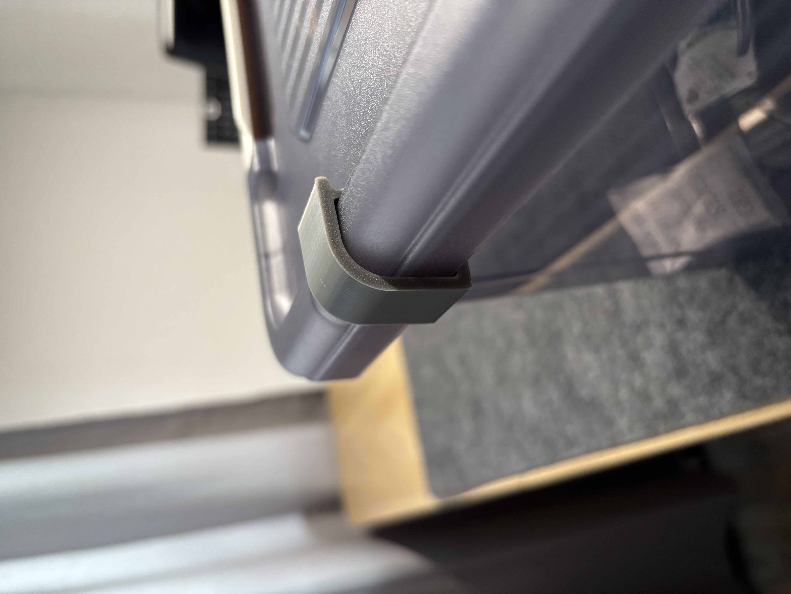
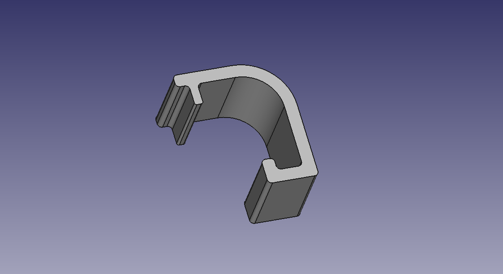
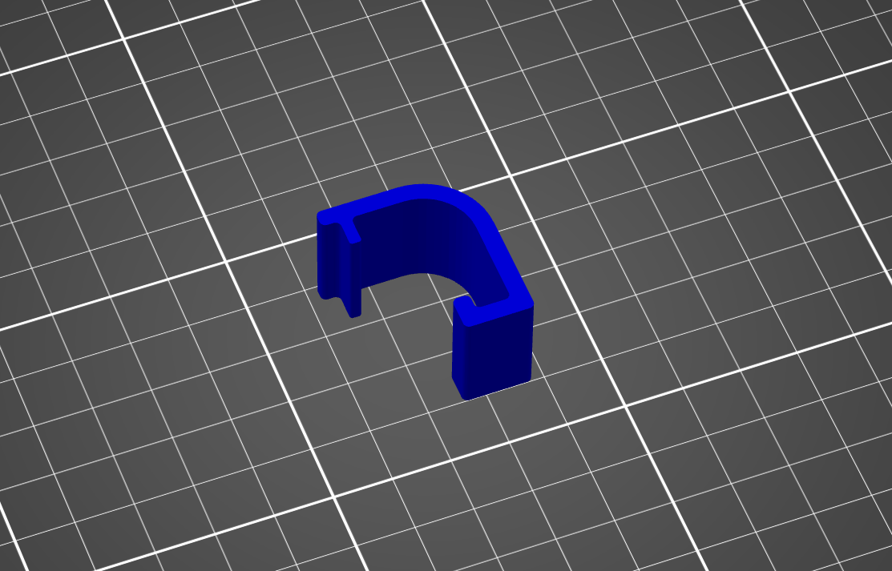

# Storage Box Clip
Clip for storagebox (brand : hobby life, stormax elite)

I made this clip to keep my box of filament and desicant tightly closed. I put a foam tape (1.5mm thick) in the lid of the box to make it airtight, but even without the strip the clips hold the container closed pretty good.

The exact model of the box is :  
Brand : Hobby Life  
Model : Stormax Elite 
Type : 16L

# Render

# Print Orientation/Settings
I printed the clips in SUNLU PLA+, 0.20mm layerheight (fine preset), 15% infill. 
With this settings the part is strong enough to hold the box closed without strain. 
I printed four clips (20mm length) for the entire box, but you can change the length of the clips to make a larger or smaller on.

